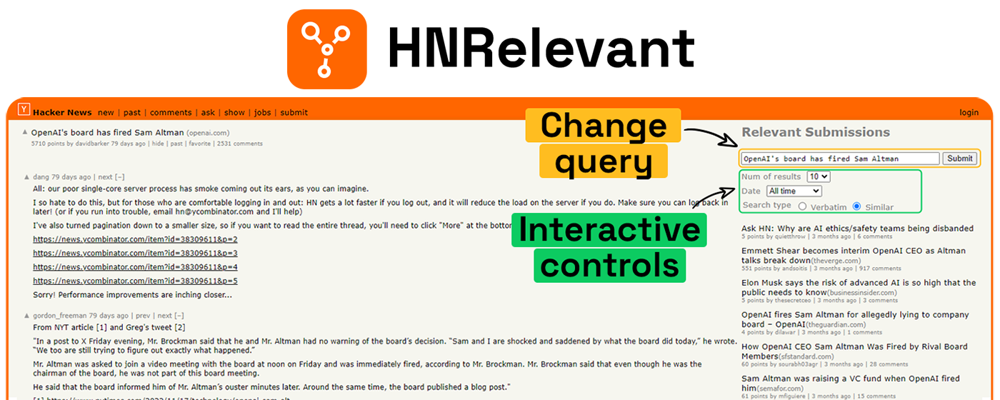

# HNRelevant
A lightweight browser extension that augments your Hacker News experience by showing related submissions to the one you're viewing. It helps you immerse yourself in interesting discussions and uncover overlooked gems.

## Features
- Related submissions ready to be explored
- Ability to fine-tune the search query and fetch results in place
- Two modes:
    - Automatic: Enjoy a seamless experience with results generated upon page load
    - Manual: Search only when desired
- The result blends naturally with Hacker News's interface and match its look and feel
- Available on Firefox for Android™
- Manageable preferences via the extension's popup in the browser toolbar

## Installation

Available on:
- **Chrome web store**: [HNRelevant](https://chromewebstore.google.com/detail/hnrelevant-related-storie/iajhnkeiioebplnbfkpnlnggkgblmoln)
- **Firefox (Desktop & Android) add-on**: [HNRelevant](https://addons.mozilla.org/en-US/firefox/addon/hnrelevant/)
- As a **Userscript**. This option also has the benefit of supporting further browsers:
    1. Make sure to have one of the userscripts extensions installed e.g: Tampermonkey, Violentmonkey, or Greasemonkey.
    2. The userscript file can be found here [HNRelevant.user.js](https://github.com/imdj/HNRelevant/raw/main/HNRelevant.user.js).
    3. Load the script into the extension of your choice.

## How it works
It's based on [HN algolia search API](https://hn.algolia.com/api) and uses the submission title as its initial query

## License
Released under the [MIT License](http://www.opensource.org/licenses/MIT). See [LICENSE](LICENSE) file for details.
